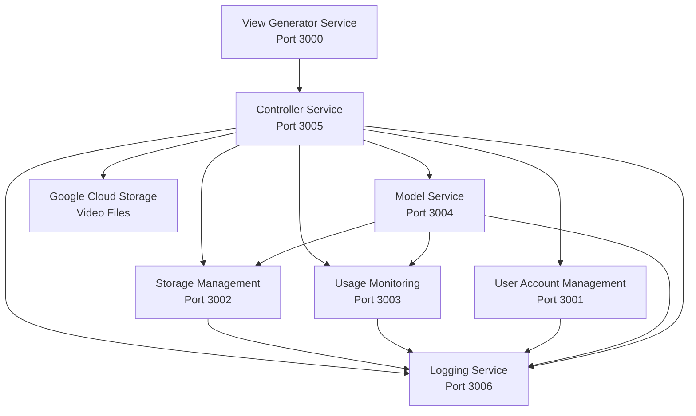

# How the Video Streaming Platform Works

## Architecture Overview

This is a microservices-based, cloud-centric short video streaming application deployed on Google Cloud Platform (GCP). The system follows a distributed architecture where each service has a specific responsibility.

## Microservices Architecture



## Service Responsibilities

### 1. View Generator Service (Frontend - Port 3000)
- **Purpose**: React-based user interface
- **Features**: 
  - TikTok-style vertical scrolling video feed
  - User authentication UI
  - Video upload interface
  - Dashboard with storage and bandwidth stats
  - Admin logs viewing (admin only)

### 2. Controller Service (Port 3005)
- **Purpose**: Orchestrates requests between services
- **Responsibilities**:
  - Routes API requests from frontend to appropriate services
  - Handles file uploads to Google Cloud Storage (GCS)
  - Generates signed URLs for secure video streaming
  - Manages authentication tokens
  - Coordinates business logic flow

### 3. User Account Management Service (Port 3001)
- **Purpose**: User authentication and account management
- **Features**:
  - User registration and login
  - JWT token generation
  - User profile management
  - Multi-tenant support
  - Role-based access control (admin/user roles)

### 4. Storage Management Service (Port 3002)
- **Purpose**: Manages file metadata and storage quotas
- **Features**:
  - 50MB storage quota per user
  - Tracks file metadata (filename, size, upload date)
  - Alerts at 80% storage usage
  - Blocks uploads at 100% capacity
  - Stores GCS file paths and URLs

### 5. Usage Monitoring Service (Port 3003)
- **Purpose**: Tracks daily bandwidth usage
- **Features**:
  - 100MB/day bandwidth limit
  - Tracks upload and delete volumes
  - Blocks uploads when limit exceeded
  - Resets daily at midnight
  - Provides usage statistics

### 6. Model Service (Port 3004)
- **Purpose**: Business logic and validation
- **Features**:
  - Validates upload requests
  - Checks storage and bandwidth availability
  - Processes video metadata
  - Coordinates between storage and usage services

### 7. Logging Service (Port 3006)
- **Purpose**: Centralized logging for all services
- **Features**:
  - Logs all system events
  - Stores logs in MongoDB
  - Provides log querying API
  - Log levels: info, warn, error
  - Service-specific and user-specific log filtering

### 8. Google Cloud Storage (GCS)
- **Purpose**: Scalable object storage for video files
- **Features**:
  - Stores actual video files
  - Private buckets with signed URL access
  - Uniform bucket-level access enabled
  - Automatic scaling
  - High availability

## Request Flows

### User Registration Flow

```
1. Frontend → Controller Service: POST /api/auth/register
2. Controller → User Service: POST /api/users/register
3. User Service → Logging Service: Log registration event
4. Controller → Storage Service: POST /api/storage/initialize (initialize storage for new user)
5. Controller → Frontend: Return success response with user data
```

### User Login Flow

```
1. Frontend → Controller Service: POST /api/auth/login
2. Controller → User Service: POST /api/users/login
3. User Service validates credentials
4. User Service → Logging Service: Log login event
5. User Service generates JWT token
6. Controller → Frontend: Return token and user data
7. Frontend stores token in localStorage
```

### Video Upload Flow

```
1. Frontend → Controller Service: POST /api/videos/upload (with video file)
2. Controller → Model Service: POST /api/videos/validate-upload
   - Model Service checks storage availability
   - Model Service checks bandwidth availability
   - Model Service → Storage Service: Check current usage
   - Model Service → Usage Service: Check bandwidth usage
3. If validation passes:
   a. Controller uploads file to GCS bucket
   b. Controller → Storage Service: POST /api/storage/:userId/add-file (record metadata)
   c. Controller → Usage Service: POST /api/usage/record (track bandwidth)
   d. Controller → Logging Service: Log upload event
   e. Controller → Frontend: Return success response
4. If validation fails: Return error to frontend
```

### Video Viewing Flow

```
1. Frontend → Controller Service: GET /api/videos (with auth token)
2. Controller validates token:
   - Option 1: Verify JWT locally using JWT_SECRET
   - Option 2: Call User Service /api/users/me to verify token
3. Controller → Storage Service: GET /api/storage/:userId (get file metadata)
4. Controller generates signed URLs for GCS files (60-minute expiry)
5. Controller → Frontend: Return video list with URLs
6. Frontend displays videos in TikTok-style vertical feed
7. When user clicks video:
   - Frontend requests: GET /api/videos/stream/:userId/:filename?token=...
   - Controller validates token and user ownership
   - Controller generates/returns signed URL
   - Browser redirects to signed URL for streaming
```

### Video Deletion Flow

```
1. Frontend → Controller Service: DELETE /api/videos/:filename (with auth token)
2. Controller validates token and user ownership
3. Controller → Storage Service: GET /api/storage/:userId (get file metadata)
4. Controller deletes file from GCS
5. Controller → Storage Service: DELETE /api/storage/:userId/files/:filename (remove metadata, update quota)
6. Controller → Usage Service: POST /api/usage/record (track deletion bandwidth)
7. Controller → Logging Service: Log deletion event
8. Controller → Frontend: Return success response
```

### Dashboard Load Flow

```
1. Frontend → Controller Service: GET /api/dashboard (with auth token)
2. Controller validates token
3. Controller → Storage Service: GET /api/storage/:userId (get storage stats)
4. Controller → Usage Service: GET /api/usage/:userId (get bandwidth stats)
5. Controller → Frontend: Return storage and usage data
6. Frontend displays stats in dashboard modal
```

### Admin Logs Viewing Flow

```
1. Admin user clicks "View Logs" button in frontend
2. Frontend checks if currentUser.role === 'admin'
3. Frontend → Logging Service: GET /api/logs?service=...&level=...&limit=100 (with auth token)
4. Logging Service validates token (should verify admin role)
5. Logging Service queries MongoDB for logs matching filters
6. Logging Service → Frontend: Return logs array
7. Frontend displays logs in modal table
```

## Authentication & Security

### JWT Token Authentication

1. **Token Generation**: User Service creates JWT tokens with 24-hour expiry
2. **Token Payload**: Contains userId, email, role, tenantId
3. **Token Storage**: Frontend stores in localStorage
4. **Token Validation**: 
   - Controller Service verifies tokens locally using JWT_SECRET
   - Falls back to User Service verification if local verification fails
5. **Token Transmission**:
   - API calls: Authorization header (`Bearer <token>`)
   - Video streaming: Query parameter (`?token=<token>`) because HTML5 video tags can't send headers

### Security Features

- All API endpoints require authentication
- Videos are stored privately in GCS (not publicly accessible)
- Signed URLs provide time-limited access (60 minutes)
- User ownership verification before video access/deletion
- Admin-only access to logs
- CORS configured for security

## Storage System

### Storage Quota Management

- **Per-User Limit**: 50MB
- **Alert Threshold**: 80% (40MB) - user receives warning
- **Block Threshold**: 100% (50MB) - uploads blocked until space freed
- **Tracking**: Storage Service tracks usedStorage and maxStorage per user

### File Storage

- **Primary Storage**: Google Cloud Storage (GCS)
- **Fallback**: Local file system (for development/error cases)
- **File Organization**: Files stored as `userId/filename` in GCS bucket
- **Metadata Storage**: MongoDB (Storage Service database)

## Bandwidth Monitoring

### Daily Bandwidth Limits

- **Per-User Limit**: 100MB/day
- **Tracking**: Usage Monitoring Service tracks totalVolume per user per day
- **Block Threshold**: 100% (100MB) - uploads blocked until next day
- **Reset**: Automatic reset at midnight (daily cycle)
- **Measurement**: Includes both uploads and deletions

## Video Streaming

### Streaming Mechanism

1. **Signed URLs**: Generated on-demand for each video access
2. **Expiry**: 60 minutes from generation
3. **Security**: URLs are private and time-limited
4. **Uniform Bucket Access**: GCS bucket uses uniform bucket-level access (no object-level ACLs)

### TikTok-Style UI

- **Layout**: Vertical scrolling feed (one video per screen)
- **Scroll Behavior**: Smooth scrolling with snap-to-video
- **Auto-play**: Videos play when scrolled into center viewport
- **Controls**: Video controls overlay with delete button
- **Responsive**: Works on mobile and desktop

## Monitoring & Logging

### Log Levels

- **Info**: Normal operations (login, upload, etc.)
- **Warn**: Warnings (storage threshold, bandwidth threshold)
- **Error**: Errors (failed operations, exceptions)

### Log Storage

- **Database**: MongoDB (Logging Service database)
- **Retention**: Configurable (default: all logs stored)
- **Querying**: Filter by service, level, userId, date range
- **Access**: Admin users only

### Dashboard Metrics

- **Storage Usage**: Real-time storage quota usage percentage
- **Bandwidth Usage**: Real-time daily bandwidth usage percentage
- **Visual Indicators**: Color-coded progress bars (green/yellow/red)

## Database Schema

### User Collection (User Service)
```javascript
{
  _id: ObjectId,
  username: String,
  email: String,
  password: String (hashed),
  role: String ('user' | 'admin'),
  tenantId: String
}
```

### Storage Collection (Storage Service)
```javascript
{
  userId: String,
  usedStorage: Number (bytes),
  maxStorage: Number (bytes, default: 50MB),
  files: [{
    filename: String,
    originalName: String,
    size: Number,
    uploadedAt: Date,
    gcsPath: String,
    gcsUrl: String
  }],
  alertSent: Boolean
}
```

### Usage Collection (Usage Service)
```javascript
{
  userId: String,
  date: Date,
  totalVolume: Number (bytes),
  maxDailyBandwidth: Number (bytes, default: 100MB),
  blocked: Boolean,
  uploads: Number,
  deletions: Number
}
```

### Logs Collection (Logging Service)
```javascript
{
  level: String ('info' | 'warn' | 'error'),
  service: String,
  message: String,
  userId: String (optional),
  timestamp: Date
}
```

## Environment Variables

Each service requires specific environment variables. See `env.example` for complete list.

Key variables:
- `JWT_SECRET`: Must match across Controller and User services
- `MONGODB_URI`: MongoDB connection string (per-service database)
- `GCS_BUCKET_NAME`: Google Cloud Storage bucket name
- `GCS_PROJECT_ID`: GCP project ID
- `GOOGLE_APPLICATION_CREDENTIALS`: Path to GCS service account key file

## Deployment

### Local Development
- Services run on ports 3000-3006
- MongoDB required (local or Atlas)
- GCS bucket and credentials required
- Use `docker-compose.yml` or `start-services.sh` script

### GCP Deployment
- Kubernetes manifests in `kubernetes/` directory
- Services deployed as pods in GKE cluster
- GCS access via service account
- Load balancer for external access

## API Endpoints

### Controller Service (Port 3005)
- `POST /api/auth/register` - Register new user
- `POST /api/auth/login` - User login
- `GET /api/dashboard` - Get dashboard data
- `GET /api/videos` - Get user's videos
- `POST /api/videos/upload` - Upload video
- `DELETE /api/videos/:filename` - Delete video
- `POST /api/videos/bulk-delete` - Bulk delete videos
- `GET /api/videos/stream/:userId/:filename` - Stream video (redirects to signed URL)

### User Service (Port 3001)
- `POST /api/users/register` - Register user
- `POST /api/users/login` - Login user
- `GET /api/users/me` - Get current user (requires auth)
- `GET /api/users/:userId` - Get user by ID

### Storage Service (Port 3002)
- `POST /api/storage/initialize` - Initialize storage for user
- `GET /api/storage/:userId` - Get storage info
- `POST /api/storage/:userId/add-file` - Add file metadata
- `DELETE /api/storage/:userId/files/:filename` - Delete file metadata

### Usage Service (Port 3003)
- `GET /api/usage/:userId` - Get usage stats
- `POST /api/usage/record` - Record usage
- `GET /api/usage/:userId/check-upload` - Check if upload allowed

### Model Service (Port 3004)
- `POST /api/videos/validate-upload` - Validate upload request
- `POST /api/videos/process-upload` - Process upload

### Logging Service (Port 3006)
- `POST /api/logs` - Create log entry
- `GET /api/logs` - Get logs (with filters)
- `GET /api/logs/service/:service` - Get logs by service
- `GET /api/logs/user/:userId` - Get logs by user
- `GET /api/logs/errors` - Get error logs
- `GET /api/logs/stats` - Get log statistics

## Technology Stack

- **Backend**: Node.js, Express.js
- **Frontend**: React, Vite
- **Database**: MongoDB
- **Storage**: Google Cloud Storage
- **Authentication**: JWT
- **Containerization**: Docker
- **Orchestration**: Kubernetes (GKE)
- **Cloud Platform**: Google Cloud Platform

## Key Design Decisions

1. **Microservices Architecture**: Separation of concerns, independent scaling
2. **JWT Authentication**: Stateless, scalable authentication
3. **GCS for Storage**: Scalable, reliable object storage
4. **Signed URLs**: Secure, time-limited video access
5. **Centralized Logging**: All services log to single service for monitoring
6. **Quota System**: Prevents abuse with storage and bandwidth limits
7. **TikTok-Style UI**: Modern, engaging user experience
8. **Mobile-First**: Vertical scrolling works perfectly on mobile devices

